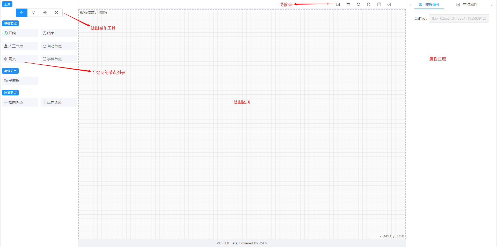
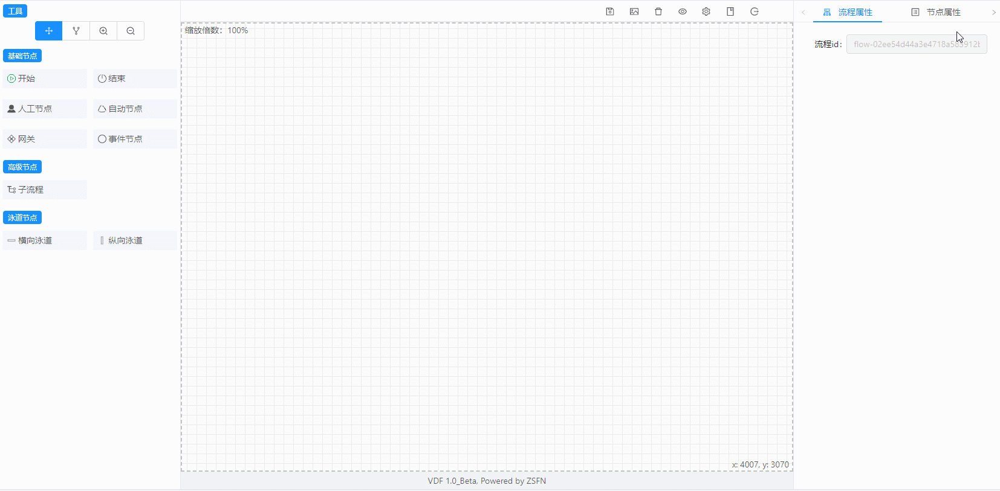
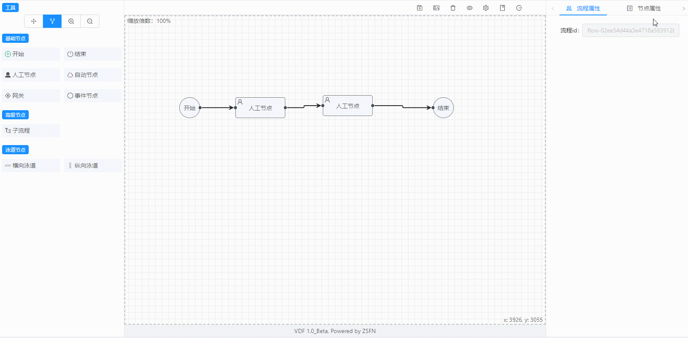
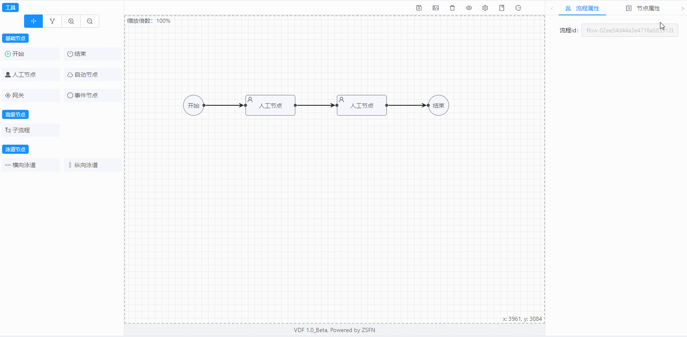
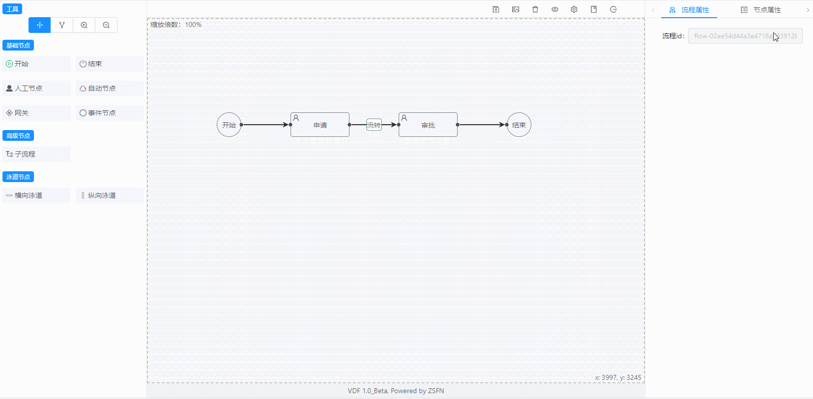
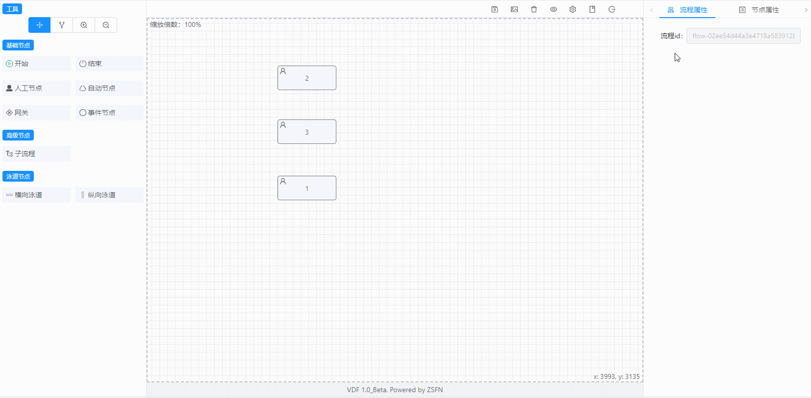
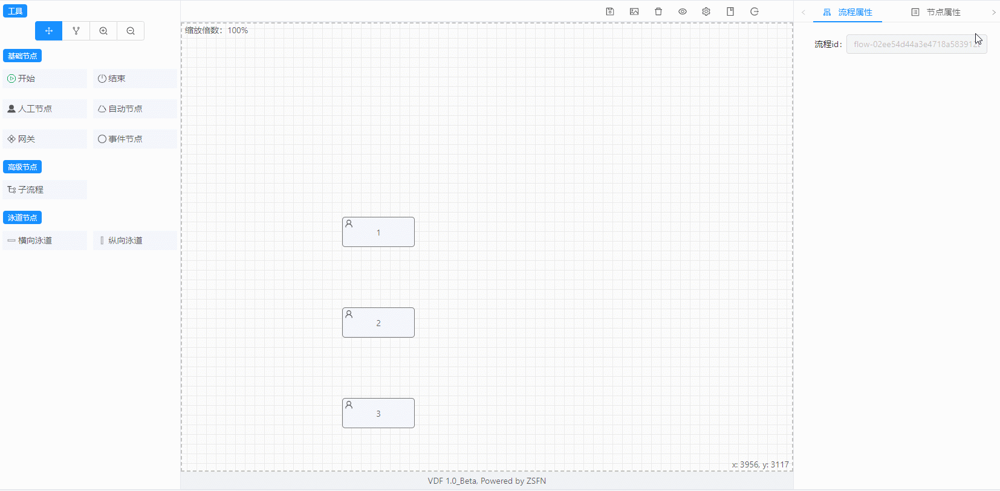
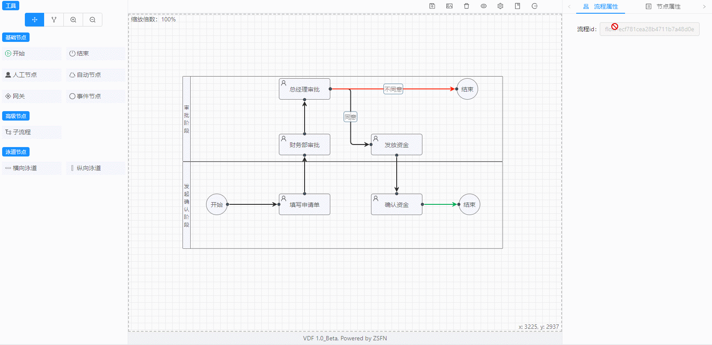
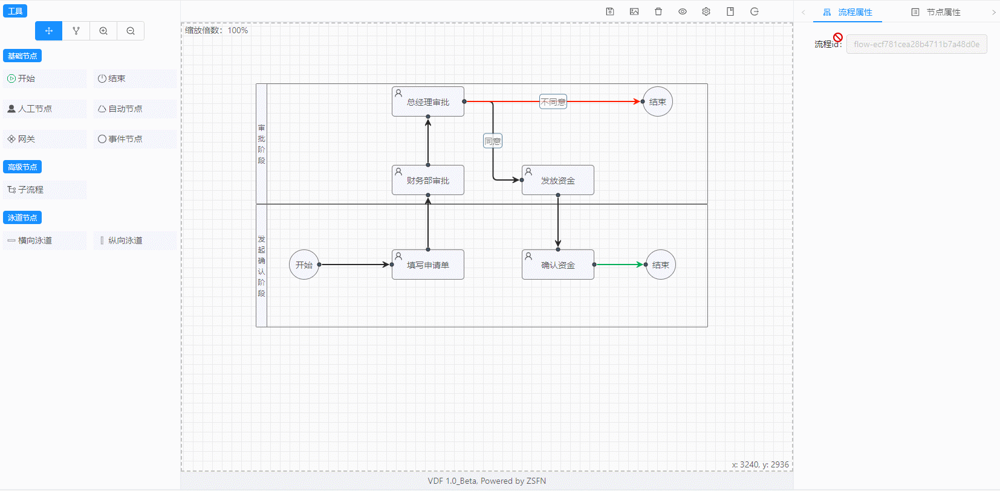
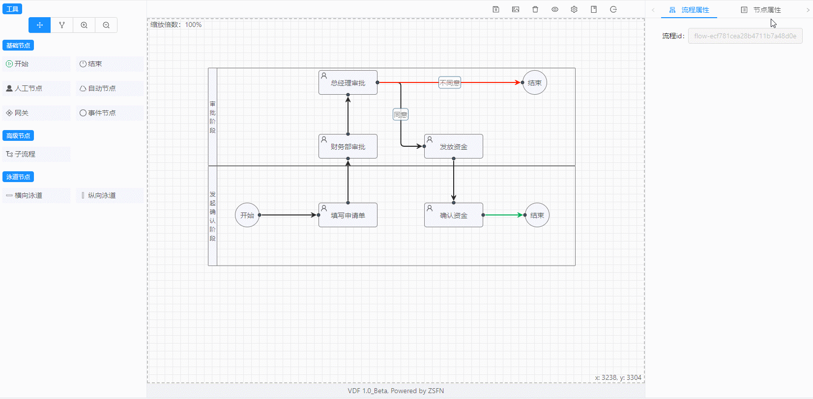

<div align=center></div>


#### 介绍
- VUE FLOW DESIGN流程设计器，基于Vue + Ant Design Vue + JSPlumb，该组件目的是为了使用在Vue项目中，它前身是[原生版流程设计器](https://gitee.com/openEA/FlowDesigner/tree/master/)。
- Vue版本以全新的技术栈重构了代码，并在原版基础上实现了更好的操作方式，新版会作为优先版本持续迭代。
- github: https://github.com/ZFSNYJ/VFD
- [演示地址](http://106.53.75.71:8080/)


#### 效果演示
* 基础面板

  

* 拖拽节点到绘图区连线

  

* 拖拽对齐或使用自动对齐

  

* 显示/隐藏网格

  

* 设置节点和连线的属性

  

* 单节点、多节点移动(按住CTRL键)

  

* 改变节点对齐的排序顺序(按住Ctrl键一个一个单击选中要对齐的节点，单击的顺序就是对齐的排列顺序)

  

* 清空画布，重新绘制

  

* 保存流程图(会生成一段json数据，后台可以保存这段数据，为了便于调试，生成的json数据可以通过快捷键CTRL+ALT+T打开的测试窗口看到。同时也可以从该窗口载入其他的符合流程图的json数据) 

  

* 保存流程图为图片保存到本地

  

* 画布拖拽、缩放

  

* 通过设置页面(CTRL+ALT+S)可以设置相关参数

  

* 快捷键说明

  

* 。。。。。。


#### 使用教程

在你的项目根目录下安装vfd：

```shell
npm install vfd --save
```

在代码中引用，类似如下：

```vue
<template>
	<div>
        <vfd></vfd>
    </div>
</template>

<script>
    import vfd from 'vfd'
    
    export default {
        components: {
            vfd
        }
    }
</script>
```


#### 捐赠作者

如果您觉得本项目对您起到一定的帮助，也可以请作者喝杯咖啡。


